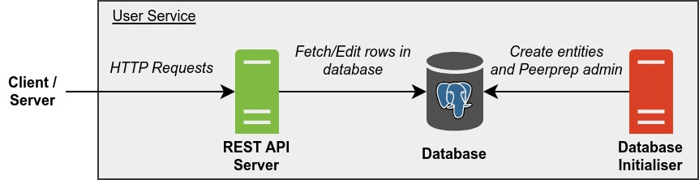

# PeerPrep User Service

Manages user information.

Provides endpoints for CRUD operations with regards to user information.

## Table of Contents

- [Build Script](#build-script)
- [Architecture](#architecture)
- [Docker Images](#docker-images)
  - [API](#api)
  - [Database Initialiser](#database-initialiser)
- [Deployment](#deployment)
  - [Kubernetes Deployment](#kubernetes-deployment)
  - [Docker Compose Deployment](#docker-compose-deployment)
- [REST API](#rest-api)
  - [Create a User](#create-a-user)
  - [Create a Session](#create-a-session)
  - [Get an Access Token](#get-an-access-token)
  - [Delete a Session](#delete-a-session)
  - [Get Usernames](#get-usernames)
  - [Get a User Profile](#get-a-user-profile)
  - [Update a User Profile](#update-a-user-profile)
  - [Update a User's Password](#update-a-users-password)
  - [Update a User's Role](#update-a-users-role)
  - [Delete a User](#delete-a-user)
  - [Get Access Token Public Key](#get-access-token-public-key)
  - [Get a User Identity](#get-a-user-identity)

## Build Script

`build_images.sh` is a build script for building the Docker images and optionally pushing them to the container registry. To get more information about the script, run:

```
./build_images.sh -h
```

## Architecture



Legend:

- Start of arrow indicates request origin and end of arrow indicates request destination.
- `#505050` Dark grey items represents internal servers/containers.
- `#DA4026` Red items represents internal servers/containers that are temporary.
- `#7FBA42` Green items represents internal servers/containers that are exposed.
- `#2072B8` Blue items represents external servers/containers.

**REST API Server**

- Handles REST API requests.
- Can be scaled horizontally.
- Corresponds to the [API](#api) docker image.

**Database Initialiser**

- Creates entities in the database and creates the default Peerprep admin account.
- Does nothing if the database already contains one or more entities it intends to create (behaviour can be changed via environment variables).
- Shuts down once it is done initialising the database.
- Corresponds to the [Database Initialiser](#database-initialiser) docker image.

**Database**

- Database for storing user information.

## Docker Images

### API

**Name:** ghcr.io/cs3219-ay2324s1-g04/peerprep_user_service_api

**Description:** Runs the REST API.

**Environment Variables:**

- `DATABASE_USER` - User on the database host.
- `DATABASE_PASSWORD` - Password of the database.
- `DATABASE_HOST` - Address of the database host.
- `DATABASE_PORT` - Port the database is listening on.
- `DATABASE_SHOULD_USE_TLS` - Should database connection be secured with TLS. Set to "true" to enable.
- `DATABASE_NAME` - Name of the database.
- `DATABASE_CONNECTION_TIMEOUT_MILLIS` - Number of milliseconds for a database client to connect to the database before timing out.
- `DATABASE_MAX_CLIENT_COUNT` - Max number of database clients.
- `HASH_COST` - Cost factor of the password hashing algorithm.
- `ACCESS_TOKEN_PRIVATE_KEY` - Private key for signing access tokens.
- `ACCESS_TOKEN_PUBLIC_KEY` - Public key for verifying access tokens.
- `SESSION_EXPIRE_MILLIS` - Number of milliseconds a user session can live for since the last expiry date and time extension.
- `ACCESS_TOKEN_EXPIRE_MILLIS` - Number of milliseconds an access token can live for.
- `PORT` - Port to listen on.
- `NODE_ENV` - Mode the app is running on ("development" or "production"). "development" mode enables features such as CORS for "localhost".

### Database Initialiser

**Name:** ghcr.io/cs3219-ay2324s1-g04/peerprep_user_service_database_initialiser

**Description:** Initialises the database by creating the necessary entities and a default Peerprep admin account.

**Environment Variables:**

- `DATABASE_USER` - User on the database host.
- `DATABASE_PASSWORD` - Password of the database.
- `DATABASE_HOST` - Address of the database host.
- `DATABASE_PORT` - Port the database is listening on.
- `DATABASE_SHOULD_USE_TLS` - Should database connection be secured with TLS. Set to "true" to enable.
- `DATABASE_NAME` - Name of the database.
- `DATABASE_CONNECTION_TIMEOUT_MILLIS` - Number of milliseconds for a database client to connect to the database before timing out.
- `DATABASE_MAX_CLIENT_COUNT` - Max number of database clients.
- `HASH_COST` - Cost factor of the password hashing algorithm.
- `ADMIN_EMAIL_ADDRESS` - Email address of the default PeerPrep admin user.
- `ADMIN_PASSWORD` - Password of the default PeerPrep admin user.
- `SHOULD_FORCE_INITIALISATION` - Should database initialisation be done regardless of whether one or more entities to be created already exist. Set to "true" to enable (may cause data loss).

## Deployment

### Kubernetes Deployment

This is the main deployment method for production.

**Note:**

- The database is hosted externally, not within the Kubernetes cluster.

**Prerequisite**

- Docker images must be pushed to the container registry and made public.
  - To push to the container registry (assuming one has the necessary permissions), run: `./build_images.sh -p`
  - To make the images public, change the visibility of the image on [GitHub](https://github.com/orgs/CS3219-AY2324S1-G04/packages).
- Kubernetes cluster must be setup as specified in the [main repository](https://github.com/CS3219-AY2324S1/ay2324s1-course-assessment-g04/blob/master/project/project.md#g04-project).

**Steps:**

1. Ensure the "peerprep" namespace has been created: `kubectl create namespace peerprep`
2. Navigate to the "kubernetes" directory: `cd kubernetes`
3. Deploy the Kubernetes objects: `./deploy.sh`
    - To delete the Kubernetes objects, run: `./delete.sh`

### Docker Compose Deployment

This is intended for development use only. It is meant to make developing other services easier.

**Note:**

- No horizontal auto scaling is provided.
- The database is created by Docker compose and data is not backed up.

**Prerequisite**

- Docker images must be built.
  - To build the images, run: `./build_images.sh`

**Steps:**

1. Ensure that the "peerprep" network exist: `docker network create -d bridge peerprep`
2. Create the docker containers: `docker compose up`
    - To delete the docker containers, run: `docker compose down`

## REST API

### Create a User

> [POST] `/user-service/users`

Creates a new user.

**Query Parameters**

- `username` - Username.
- `email-address` - Email address.
- `password` - Password.

**Response**

- `201` - User created.
- `400` - One or more query parameters are invalid. The reason for the error is provided in the response body.
  - Example response body:
    ```json
    {
      "username": "Username cannot be empty.",
      "email-address": "Email address cannot be empty.",
      "password": "Password cannot be empty."
    }
    ```
- `500` - Unexpected error occurred on the server.

### Create a Session

> [POST] `/user-service/sessions`

Creates a new user session.

**Query Parameters**

- `username` - Username.
- `password` - Password.

**Response**

- `201` - Session created.
  - Cookies:
    - `session-token` - Contains session token. This cookie is HTTP-only.
    - `access-token` - Contains access token. This cookie is HTTP-only.
    - `access-token-expiry` - Contains expiry of the access token.
- `400` - One or more query parameters are invalid. The reason for the error is provided in the response body.
  - Example response body:
    ```json
    {
      "username": "Username cannot be empty.",
      "password": "Password cannot be empty."
    }
    ```
- `401` - Username is not in use or the username and password do not match.
- `500` - Unexpected error occurred on the server.

### Get an Access Token

> [GET] `/user-service/session/access-token`

Gets an access token for the user who owns the specified session token.

A successful request to this endpoint will also extend the expiry of the session whose session token was specified.

**Cookies**

- `session-token` - Session token.

**Response**

- `200` - Success.
  - Cookies:
    - `session-token` - Contains session token. This cookie is HTTP-only. This is sent to extend the lifespan of the cookie on the browser.
    - `access-token` - Contains access token. This cookie is HTTP-only.
    - `access-token-expiry` - Contains expiry of the access token.
- `401` - Session token was not provided or is invalid.
- `500` - Unexpected error occurred on the server.

### Delete a Session

> [DELETE] `/user-service/session`

Deletes the session whose session token is the one specified.

**Cookies**

- `session-token` - Session token.

**Response**

- `200` - Success.
  - Cookies:
    - `session-token` - Expired cookie.
    - `access-token` - Expired cookie.
    - `access-token-expiry` - Expired cookie.
- `401` - Session token was not provided or is invalid.
- `500` - Unexpected error occurred on the server.

### Get Usernames

> [GET] `/user-service/users/all/username`

Gets the usernames of all users whose user ID is specified.

**Query Parameters**

- `user-ids` - Array of user IDs in JSON format. (e.g. `[7,11,404]`)

**Response**

- `200` - Success. User IDs and their corresponding usernames are stored as a JSON string in the response body. User IDs which do not belong to any user would not be included in the response.
  - Example response body:
    ```json
    {
      "7": "foo",
      "11": "bar"
    }
    ```
- `400` - One or more query parameters are invalid. The reason for the error is provided in the response body.
  - Example response body:
    ```json
    {
      "user-ids": "User IDs must be a JSON array.",
    }
- `500` - Unexpected error occurred on the server.

### Get a User Profile

> [GET] `/user-service/user/profile`

Gets the profile of the user who owns the specified access token.

**Cookies**

- `access-token` - Access token.

**Response**

- `200` - Success. User's profile information is stored as a JSON string in the response body.
  - Example response body:
    ```json
    {
      "username": "foo",
      "email-address": "foo@bar.com",
      "user-id": 2,
      "user-role": "user"
    }
    ```
- `401` - Access token was not provided or is invalid.
- `500` - Unexpected error occurred on the server.

### Update a User Profile

> [PUT] `/user-service/user/profile`

Updates the profile of the user who owns the specified session token.

Since this is a high threat operation, the user must provide their session token.

Note that all fields of the user profile must be provided including fields that have not been updated.

**Query Parameters**

- `username` - Updated username.
- `email-address` - Updated email address.

**Cookies**

- `session-token` - Session token.

**Response**

- `200` - Success.
  - Cookies:
    - `access-token` - Contains access token. This cookie is HTTP-only.
    - `access-token-expiry` - Contains expiry of the access token.
- `400` - One or more query parameters are invalid. The reason for the error is provided in the response body.
  - Example response body:
    ```json
    {
      "username": "Username cannot be empty.",
      "email-address": "Email address cannot be empty."
    }
    ```
- `401` - Access token was not provided or is invalid.
- `500` - Unexpected error occurred on the server.

### Update a User's Password

> [PUT] `/user-service/user/password`

Updates the password of the user who owns the specified session token.

Since this is a high threat operation, the user must provide their session token and also their current password.

**Query Parameters**

- `password` - Password for verifying the user.
- `new-password` - New password to update to.

**Cookies**

- `session-token` - Session token.

**Response**

- `200` - Success.
- `400` - New password is not a valid password. The reason for the invalidity is provided in the response body.
  - Example response body:
    ```json
    {
      "new-password": "Password cannot be empty."
    }
    ```
- `401` - Session token was not provided, or session token is invalid, or password is incorrect.
- `500` - Unexpected error occurred on the server.

### Update a User's Role

> [PUT] `/user-service/users/:user-id/user-role`

Updates the user role of a user.

The user making the request must have the "admin" user role. Since this is a high threat operation, the user must provide their session token.

**Path Parameters**

- `user-id` - User ID of the user whose user role is to be updated.

**Query Parameters**

- `user-role` - Updated user role.

**Cookies**

- `session-token` - Session token of the user making the request.

**Response**

- `200` - Success.
- `400` - One or more query parameters are invalid. The reason for the error is provided in the response body.
  - Example response body:
    ```json
    {
      "user-role": "User role is invalid."
    }
    ```
- `401` - Session token was not provided, or is invalid, or does not belong to a user with the "admin" user role.
- `404` - User ID does not belong to any existing user.
- `500` - Unexpected error occurred on the server.

### Delete a User

> [DELETE] `/user-service/user`

Deletes the user who owns the specified session token.

Since this is a high threat operation, the user must provide their session token and also their password.

**Query Parameters**

- `password` - Password for verifying the user.

**Cookies**

- `session-token` - Session token.

**Response**

- `200` - Success.
  - Cookies:
    - `session-token` - Expired cookie.
    - `access-token` - Expired cookie.
    - `access-token-expiry` - Expired cookie.
- `401` - Session token was not provided, or session token is invalid, or password is incorrect.
- `500` - Unexpected error occurred on the server.

### Get Access Token Public Key

> [GET] `/user-service/access-token-public-key`

Gets the public key for verifying access tokens.

**Response**

- `200` - Success. The response body will contain the public key.
- `500` - Unexpected error occurred on the server.

### Get a User Identity

> [GET] `/user-service/user/identity`

Gets the user ID and user role of the user who owns the specified session token.

This is only intended to be used by other services when performing high threat model operations, where trusting the information stored in a valid access token is risky.

**Query Parameters**

- `session-token` - Session token.

**Response**

- `200` - Success. User ID and user role are stored in the response body.
  - `user-role` can have the value `admin`, `maintainer`, or `user`
  - Example response body:
    ```json
    {
      "user-id": 2,
      "user-role": "user"
    }
    ```
- `401` - Session token was not provided or is invalid.
- `500` - Unexpected error occurred on the server.
